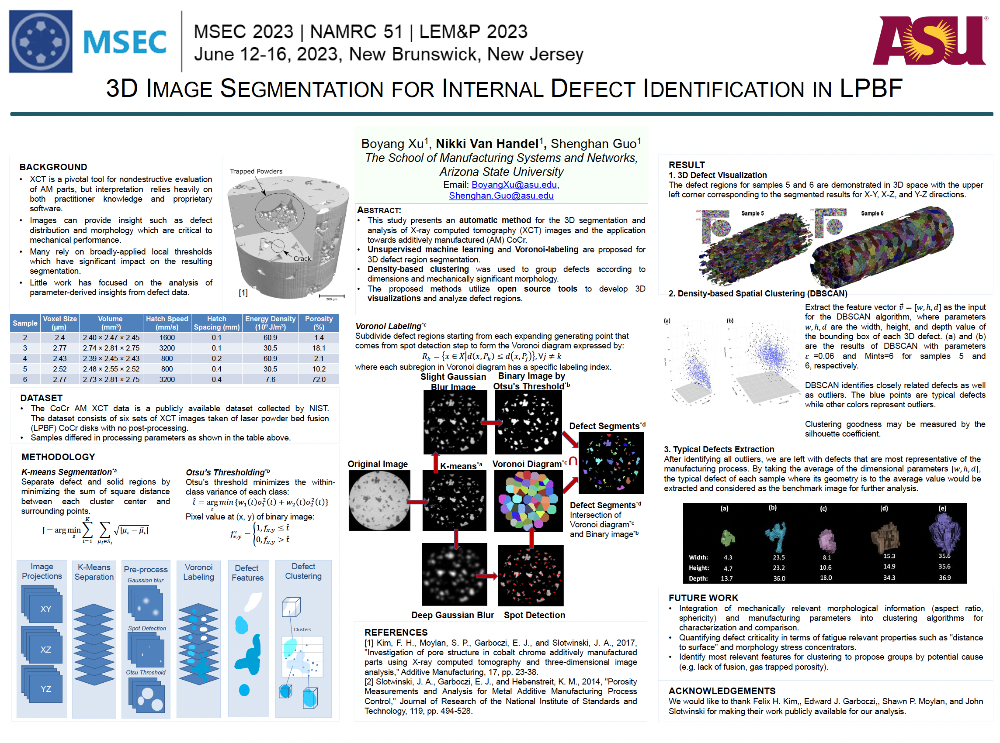

# XCT Defect Segmentation for LPBF Parts

Automatic 3D segmentation, point-cloud reconstruction, and analysis of internal
defects in **laser powder bed fusion (LPBF)** parts from **X-ray computed
tomography (XCT)**. This repository implements the method from:

> **3-D Image Segmentation and Point Cloud Modeling for Internal Defect
> Identification in Laser Powder Bed Fusion Parts**
> Boyang Xu, Nicole Van Handel, and Shenghan Guo
> School of Manufacturing Systems and Networks, Arizona State University
> *(presented at MSEC 2023)*

## Overview

<p align="center">
  
  <br>
  <em>Figure 1. The three-stage ST-FFT framework.</em>
</p>

Internal defects — porosity, overheating, poor fusion — degrade the mechanical
performance of LPBF parts. XCT is the preferred non-destructive way to inspect
them, but interpretation usually leans on practitioner knowledge and
proprietary software, and most workflows rely on broadly-applied local
thresholds that strongly affect the result.

This pipeline segments each XCT volume into individually labeled 3D defect
regions, extracts geometric features (volume, equivalent spherical diameter,
bounding box, aspect ratio), and uses **unsupervised clustering (DBSCAN)** to
separate *typical* defects from *outliers*, yielding a benchmark defect per
sample for cross-condition comparison. It is built entirely on open-source
tools and validated on the publicly available **NIST CoCr** XCT dataset.

## Method

```
 XCT slice stack ─► (1) preprocess ─► (2) Voronoi-Otsu ─► (3) features ─► (4) DBSCAN ─► (5) point cloud
                     K-means              3D labeling       volume/ESD/      typical vs.    export &
                     denoise                                bbox/porosity    outliers       projections
```

1. **Preprocessing — `xctdefect.preprocess`.** A 1D K-means on each slice
   separates dark defect pixels from the bright solid material, suppressing
   speckle while preserving defect regions.
2. **3D Voronoi-Otsu labeling — `xctdefect.segmentation`.** Gaussian blur +
   spot detection seeds one point per defect; Otsu thresholding gives a binary
   defect mask; Voronoi labeling grows each seed and is intersected with the
   mask so every connected defect gets a unique label. Uses the GPU backend
   (pyclesperanto) when available, with a scikit-image / SciPy CPU fallback.
3. **Feature extraction — `xctdefect.features`.** Per-defect voxel volume,
   equivalent spherical diameter (ESD), bounding-box dimensions, centroid, and
   aspect ratio, plus global porosity.
4. **DBSCAN clustering — `xctdefect.clustering`.** Defects are clustered in the
   sorted bounding-box feature space `[max, mid, min]` (min-max scaled).
   DBSCAN flags outliers (`-1`); the mean dimensions of the remaining typical
   defects define a benchmark. A k-distance helper guides the `eps` choice and
   a silhouette score measures cluster quality.
5. **Point clouds — `xctdefect.pointcloud`.** Any defect (or all of them) can
   be exported as an `(x, y, z)` point cloud, plus max-intensity projections
   along each axis for quick visualization.

## NIST CoCr dataset

The method is demonstrated on six XCT scans of LPBF CoCr disks (publicly
released by NIST), which differ in process parameters and porosity:

| Sample | Voxel size (µm) | Hatch speed (mm/s) | Hatch spacing (mm) | Energy density (10⁹ J/m³) | Porosity (%) |
|---|---|---|---|---|---|
| 2 | 2.40 | 1600 | 0.1 | 60.9 | 1.4 |
| 3 | 2.77 | 3200 | 0.1 | 30.5 | 18.1 |
| 4 | 2.43 | 800  | 0.2 | 60.9 | 2.1 |
| 5 | 2.52 | 800  | 0.4 | 30.5 | 10.2 |
| 6 | 2.77 | 3200 | 0.4 | 7.6  | 72.0 |

## Installation

```bash
git clone https://github.com/BoyangASU/xct-defect-segmentation.git
cd xct-defect-segmentation
pip install -e .                  # core (CPU) pipeline
pip install -e ".[notebook]"      # + jupyter / seaborn / tqdm for the demo
pip install -e ".[gpu]"           # optional pyclesperanto GPU labeling
pip install -e ".[viz]"           # optional plotly / napari / open3d
```

Requires Python ≥ 3.9. Core dependencies: NumPy, SciPy, scikit-image,
scikit-learn, OpenCV, pandas, matplotlib. The GPU backend is **optional** — the
pipeline falls back to a pure-CPU implementation automatically.

## Quick start

```python
import xctdefect

# volume: a (H, W, D) XCT stack with defects brighter than the solid
out = xctdefect.run_pipeline(volume, voxel_size=2.52,
                             spot_sigma=4.0, outline_sigma=5.0,
                             eps=0.04, min_samples=6)

print(int(out["labels"].max()))     # number of defects
print(out["porosity"])              # global porosity
print(out["benchmark"])             # typical-defect bounding box
out["table"].head()                 # per-defect feature table
```

### Loading the NIST data

```python
from xctdefect import io

volume = io.load_tiff_stack("data/sample5", crop=(60, 420, 150, 500))
```

### Step-by-step control

```python
import xctdefect

vol = xctdefect.preprocess.kmeans_volume(volume)            # (1) denoise
labels = xctdefect.segmentation.voronoi_otsu_labeling(      # (2) label
    vol, spot_sigma=4.0, outline_sigma=5.0)

table = xctdefect.features.defect_table(labels, voxel_size=2.52)   # (3)
porosity = xctdefect.features.global_porosity(labels)

feats = xctdefect.clustering.sorted_dimension_features(table)      # (4)
kd = xctdefect.clustering.kdistance(feats, k=6)                    # pick eps
cluster_labels, summary = xctdefect.clustering.dbscan_cluster(feats, eps=0.04)
benchmark, typical = xctdefect.clustering.typical_defect(table, cluster_labels)

pc = xctdefect.pointcloud.defect_point_cloud(labels, label_id=550) # (5)
xctdefect.pointcloud.save_npy(pc, "defect_550.npy")
```

## Demo notebook

[`notebooks/demo.ipynb`](notebooks/demo.ipynb) runs the full pipeline on a
**synthetic CT volume**, so it works out of the box without the large XCT
stacks. It covers segmentation, the pore-size (ESD) distribution, DBSCAN
clustering with a k-distance plot, and a 3D point-cloud scatter.

```bash
jupyter notebook notebooks/demo.ipynb
```

## Repository layout

```
xct-defect-segmentation/
├── src/xctdefect/
│   ├── __init__.py        # public API + run_pipeline()
│   ├── io.py              # load XCT TIFF slice stacks
│   ├── preprocess.py      # K-means defect/solid separation, median denoise
│   ├── segmentation.py    # 3D Voronoi-Otsu labeling (GPU + CPU fallback)
│   ├── features.py        # per-defect volume / ESD / bbox / porosity
│   ├── clustering.py      # DBSCAN, k-distance, typical-defect extraction
│   └── pointcloud.py      # point-cloud export & max projections
├── notebooks/
│   └── demo.ipynb         # runnable end-to-end demo (synthetic data)
├── pyproject.toml
├── requirements.txt
└── README.md
```

## Notes on the data

The NIST CoCr XCT scans are large and not bundled here. Download them from
NIST and point `xctdefect.io.load_tiff_stack` at the slice folders, or use the
synthetic generator in the demo notebook as a template. `.gitignore` excludes
`*.tif`, `*.npy`, and `data/` so raw scans are never committed.

## Citation

```bibtex
@inproceedings{xu_xct_lpbf,
  title     = {3-D Image Segmentation and Point Cloud Modeling for Internal
               Defect Identification in Laser Powder Bed Fusion Parts},
  author    = {Xu, Boyang and Van Handel, Nicole and Guo, Shenghan},
  booktitle = {ASME Manufacturing Science and Engineering Conference (MSEC)},
  year      = {2023},
  note      = {School of Manufacturing Systems and Networks, Arizona State University}
}
```

Dataset: F. H. Kim, S. P. Moylan, E. J. Garboczi, J. A. Slotwinski,
"Investigation of pore structure in cobalt chrome additively manufactured parts
using X-ray computed tomography and three-dimensional image analysis,"
*Additive Manufacturing*, 17, pp. 23–38, 2017.

## Acknowledgements

Thanks to Felix H. Kim, Edward J. Garboczi, Shawn P. Moylan, and John Slotwinski
for making the NIST CoCr XCT dataset publicly available.

## License

MIT — see [LICENSE](LICENSE).
